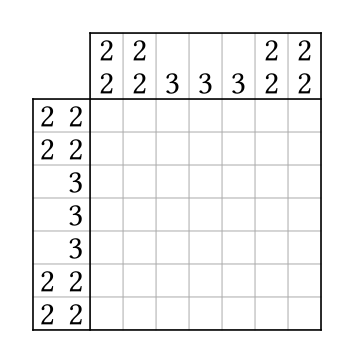

# Symmetric Nonogram

The purpose of this project is to determine if there are any symmetric nonograms with a unique solution that cannot be solved locally. To read more about local nonograms, see [https://github.com/olligobber/LocalNonogram](github.com/olligobber/LocalNonogram). The code has been used to find a symmetric 7x7 nonogram with a unique solution that cannot be solved locally:



## Executables

### Symmetric Grids

This executable takes the width and height on separate lines, and outputs every symmetric nonogram solution of that size, one per line. For example,

```
$ echo -e "3\n3" | stack exec SymmetricGrids
00020002000
11121112111
11121012111
10120102101
10120002101
01021112010
01021012010
00020102000
```

### To Hints

This executable takes a list of solutions, one on each line, and turns each one into its hints, outputting them one per line. For example:

```
$ echo -e "01210\n01121102101" | stack exec ToHints
1;1/1;1
2;2;1,1/2;2;1,1
```

### Filter Local

This executable takes a list of hints, one on each line, and removes the ones that are locally solvable, outputting the ones that aren't locally solvable one per line. For example:

```
$ echo -e "1/\n1/1\n1;1;1;1/1,1;2\n1;1;1/1,1;1" | stack exec FilterLocal
1/
1;1;1;1/1,1;2
```

### Filter Multiple Solutions

This executable takes a list of hints, one on each line, and removes the ones that have multiple solutions, outputting the ones with at most one solution one per line.